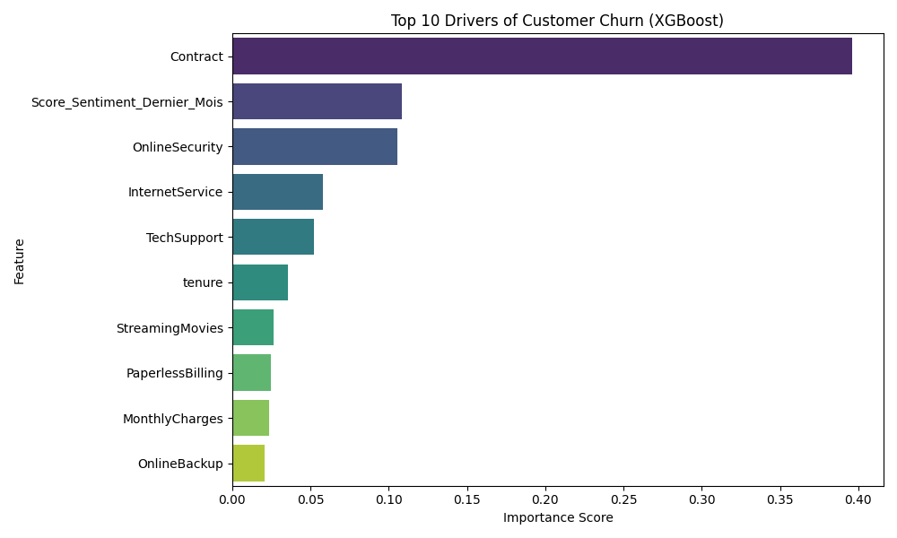
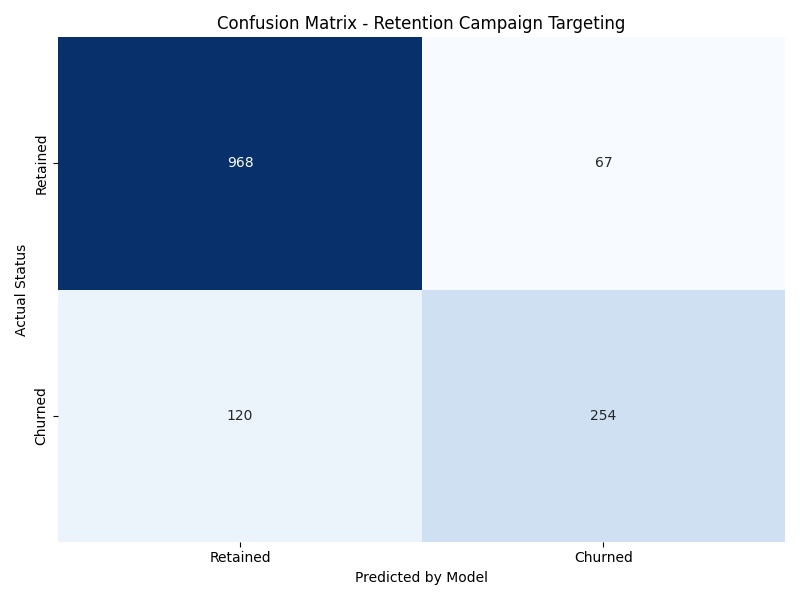

# Mouad Bakhchane | Data & BI Consultant

**Senior Data & BI Consultant** specializing in building reliable, high-performance data systems that drive business decisions.


## 🚀 About This Portfolio
This repository hosts my professional portfolio website, built with **Next.js 15**, **Tailwind CSS**, and **framer-motion**. It showcases my approach to data engineering, analytics, and business intelligence.

**Live Demo**: [mouad-bakhchane-portfolio.vercel.app](https://mouad-bakhchane-portfolio.vercel.app)

---

## 🏆 Featured Project: AI-Powered Churn Retention System
> **"Gold Standard" Case Study (Fall 2025)**

This repository includes the full code for my **end-to-end customer churn prediction system**, designed to transform reactive retention into a proactive revenue engine.

### Key Features
- **Snowflake Architecture**: Single Source of Truth for customer data.
- **XGBoost Model**: State-of-the-art binary classification (Acc: 87%, AUC: 0.92).
- **ROI Calculator**: Simulates business financial impact ($190k/mo savings).
- **Salesforce Integration**: Mock capabilities for CRM activation.

### How to Run the Model
1. **Navigate to the root directory**.
2. **Install Python dependencies**:
   ```bash
   pip install pandas xgboost scikit-learn seaborn matplotlib
   ```
3. **Run the pipeline**:
   ```bash
   python churn_prediction_model.py
   ```
   *Note: The script runs in "Snowflake Simulation Mode" using a local CSV extract (`Telco_Churn_Enrichi_GCP.csv`) for portability.*

### Visual Results
| Feature Importance | Confusion Matrix |
| :---: | :---: |
|  |  |

---

## 🛠 Tech Stack
- **Frontend**: Next.js 15, React, TypeScript, Tailwind CSS
- **Data Engineering**: Python, SQL, dbt, Snowflake
- **Machine Learning**: XGBoost, Scikit-Learn
- **Visualization**: Power BI, Matplotlib/Seaborn

## 📬 Contact
**Mouad Bakhchane**  
*Available for freelance opportunities*  
[LinkedIn](https://linkedin.com/in/mouadbakhchane) | [Email](mailto:contact@mouad-data.com)
